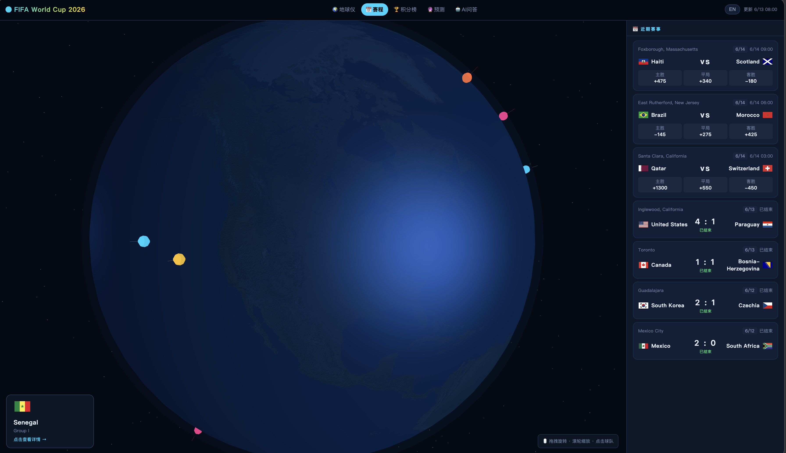
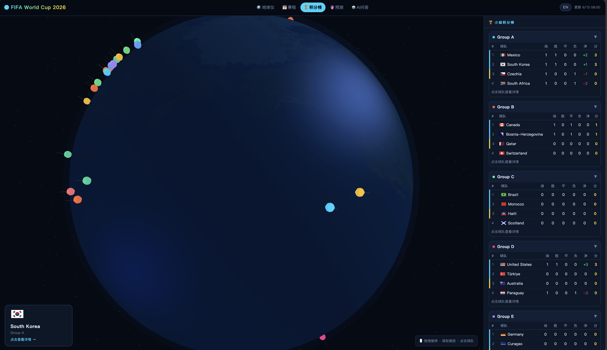
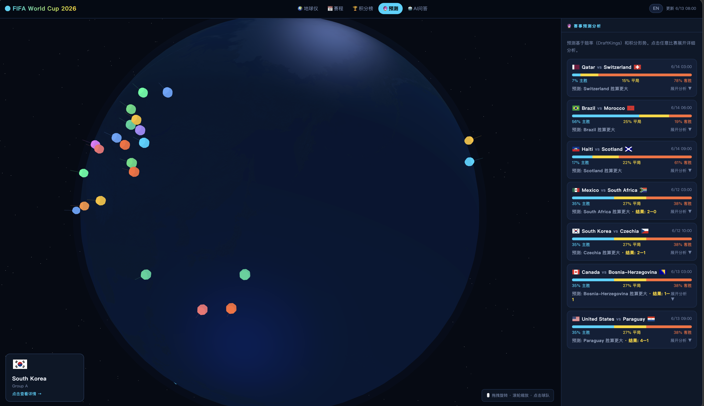
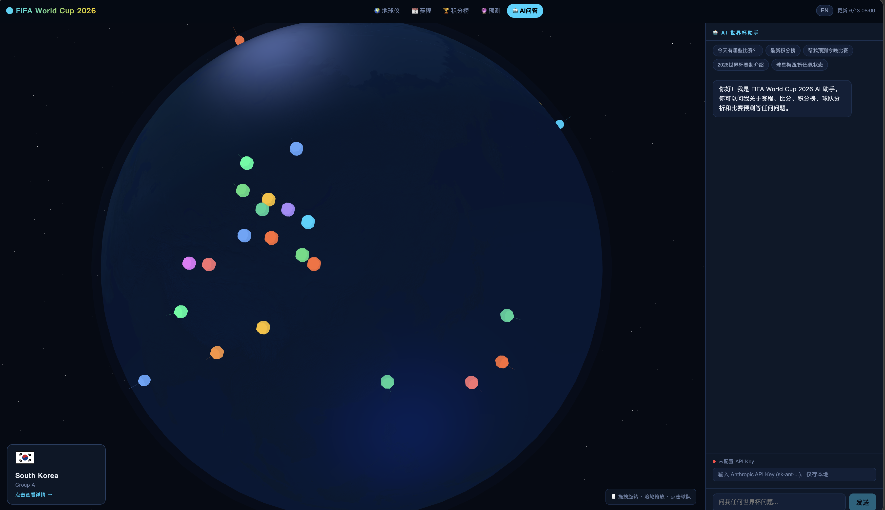

# 🏆 World Cup 2026 Dashboard

**实时世界杯数据可视化平台** — 3D 地球仪 · 赛程比分 · 积分榜 · 淘汰赛 · 预测 · AI 助手

🌐 **[在线访问 →](https://skyseraph.github.io/world-cup-2026/)**

---

## 预览

<table>
  <tr>
    <td align="center"><b>🌍 3D 地球仪 + 赛程比分</b></td>
    <td align="center"><b>📊 积分榜</b></td>
  </tr>
  <tr>
    <td></td>
    <td></td>
  </tr>
  <tr>
    <td align="center"><b>🔮 赛事预测</b></td>
    <td align="center"><b>🤖 AI 助手</b></td>
  </tr>
  <tr>
    <td></td>
    <td></td>
  </tr>
</table>

---

## 功能

### 核心可视化
- **3D 地球仪** — 48 支参赛队在地图上实时标注，按小组着色，点击查看球队详情、同组球队、本届赛事
- **赛程 & 比分** — 覆盖 ±4 天赛事，支持按状态筛选（今日 / 进行中 / 未开始 / 已结束 / 关注），点击查看完整比赛时间线（进球 / 换人 / 黄红牌）
- **积分榜** — 12 个小组实时排名，带积分 / 净胜球 / 近期状态，支持折叠/展开
- **淘汰赛对阵图** — CSS bracket 树形布局，R32 → R16 → 四强 → 决赛，小组赛阶段显示占位提示

### 数据榜单
- **射手榜** — 从所有比赛时间线聚合进球数，实时排名
- **黄牌榜** — 聚合黄牌事件，tab 切换

### 分析 & 预测
- **赛事预测** — 基于积分榜 + 近期状态生成胜负概率，展示概率条 + 胜平负百分比 + 对比分析
- **球队对比** — 选任意两支球队，并排对比积分 / 进球 / 失球 / 净胜球 / 近5场状态

### 个性化
- **关注球队** — 在积分榜或球队详情面板点 ★ 收藏，赛程筛选"关注"tab 一键过滤，数据存 localStorage
- **倒计时** — Header 常驻"距下场 X:XX:XX"，显示下一场比赛的队名
- **日历导出** — 全部赛程一键导出为 `.ics` 文件；单场比赛卡片也可单独导出，直接导入手机/电脑日历

### 直播 & 社区
- **直播入口** — 汇整国内外主流直播频道，区分国内 / 国际，LIVE 状态高亮
- **比赛详情** — 点击比赛卡片可查看流媒体链接 + 实时投票（GitHub OAuth 登录）
- **留言** — 基于 Giscus + GitHub Discussions，无需额外后端

### AI 助手
- **AI 问答** — 内置 Claude 聊天，使用自己的 Anthropic API Key，密钥仅存于本地 localStorage
- **快捷提问** — 预设常用问题按钮，一键发问

### 国际化
- **中英双语** — 一键切换，默认中文，所有界面文案同步翻译

---

## 数据更新

GitHub Actions 每 **30 分钟**自动抓取最新赛事数据并提交到仓库，页面无需后端即可保持实时。

```
fetch-data.yml   → 抓取赛程 / 积分 / 时间线 → 写入 data/*.json
deploy.yml       → push 后自动部署到 GitHub Pages
```

数据来源：[sports-skills](https://github.com/machina-sports/sports-skills) (ESPN API，无需 Key)

---

## 本地运行

```bash
# 克隆仓库
git clone https://github.com/skyseraph/world-cup-2026.git
cd world-cup-2026

# 直接用任意静态服务器打开（无需 Node/构建工具）
npx serve .
# 或
python3 -m http.server 8080
```

访问 `http://localhost:8080`

### 手动刷新数据

```bash
pip install sports-skills
python3 scripts/fetch_data.py
```

---

## 技术栈

| 层 | 技术 |
|----|------|
| 前端 | 纯 HTML + ES Modules，无构建工具 |
| 3D 渲染 | Three.js v0.165 (CDN importmap) |
| 数据管道 | GitHub Actions + Python sports-skills CLI |
| 部署 | GitHub Pages (静态) |
| AI | Anthropic Claude API (浏览器直连，Key 存 localStorage) |
| 留言 | Giscus (GitHub Discussions) |
| 投票 | GitHub OAuth Device Flow |

---

## 赛事信息

- **赛制**：48 队，12 小组，小组赛 + 淘汰赛
- **举办地**：美国 / 加拿大 / 墨西哥
- **时间**：2026 年 6 月 11 日 — 7 月 19 日

---

<div align="center">
  <sub>数据每 30 分钟自动更新 · Powered by Claude + Three.js + GitHub Actions</sub>
</div>
